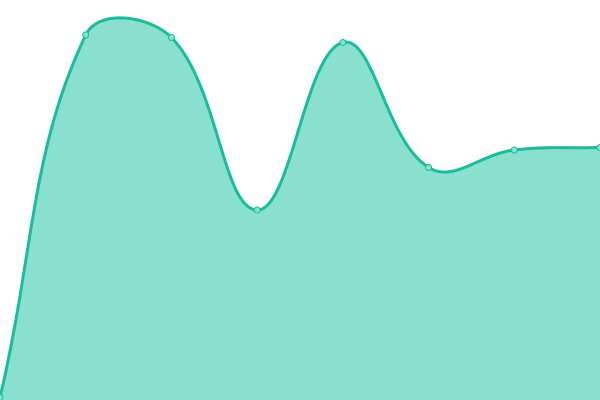
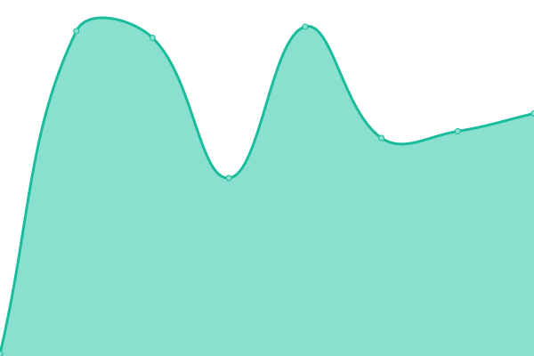

# [📈 Live Status](https://status.willwilson.uk): <!--live status--> **🟧 Partial outage**

This repository contains the open-source uptime monitor and status page for [Upptime](https://upptime.js.org), powered by [Upptime](https://github.com/upptime/upptime).

With [Upptime](https://upptime.js.org), you can get your own unlimited and free uptime monitor and status page, powered entirely by a GitHub repository. We use [Issues](https://github.com/upptime/upptime/issues) as incident reports, [Actions](https://github.com/thewillwilson/upptime/actions) as uptime monitors, and [Pages](https://status.willwilson.uk) for the status page.

<!--start: status pages-->
<!-- This summary is generated by Upptime (https://github.com/upptime/upptime) -->
<!-- Do not edit this manually, your changes will be overwritten -->
<!-- prettier-ignore -->
| URL | Status | History | Response Time | Uptime |
| --- | ------ | ------- | ------------- | ------ |
|  [Main Site](https://willwilson.uk) | 🟥 Down | [main-site.yml](https://github.com/thewillwilson/upptime/commits/HEAD/history/main-site.yml) | 

 0ms
     
 | 

<a href="https://status.willwilson.uk/history/main-site">0.00%</a>
    

|  [Home Assistant](https://ha.willwilson.uk) | 🟩 Up | [home-assistant.yml](https://github.com/thewillwilson/upptime/commits/HEAD/history/home-assistant.yml) | 

 689ms
     
 | 

<a href="https://status.willwilson.uk/history/home-assistant">100.00%</a>
    

|  [LON01 POP](lon01.pop.as214818.willwilson.uk) | 🟩 Up | [lon-01-pop.yml](https://github.com/thewillwilson/upptime/commits/HEAD/history/lon-01-pop.yml) | 

 99ms
     
 | 

<a href="https://status.willwilson.uk/history/lon-01-pop">100.00%</a>
    

|  [LON02 POP](lon02.pop.as214818.willwilson.uk) | 🟥 Down | [lon-02-pop.yml](https://github.com/thewillwilson/upptime/commits/HEAD/history/lon-02-pop.yml) | 

 0ms
     
 | 

<a href="https://status.willwilson.uk/history/lon-02-pop">0.00%</a>
    

|  [COV01 POP](cov01.pop.as214818.willwilson.uk) | 🟩 Up | [cov-01-pop.yml](https://github.com/thewillwilson/upptime/commits/HEAD/history/cov-01-pop.yml) | 

 103ms
     
 | 

<a href="https://status.willwilson.uk/history/cov-01-pop">100.00%</a>
    

<!--end: status pages-->

[**Visit our status website →**](https://status.willwilson.uk)

## 📄 License

- Powered by: [Upptime](https://github.com/upptime/upptime)
- Code: [MIT](./LICENSE) © [Anand Chowdhary](https://anandchowdhary.com), supported by [Pabio](https://pabio.com)
- Data in the `./history` directory: [Open Database License](https://opendatacommons.org/licenses/odbl/1-0/)
